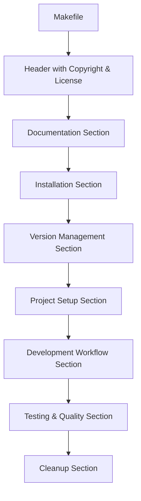
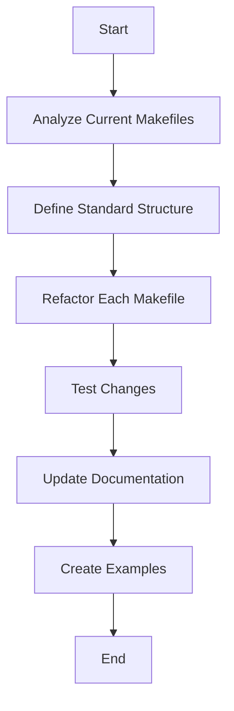

# AWS Code Habits Refactoring Plan

## Project Understanding

AWS Code Habits is a library with Make targets, Ansible playbooks, and Jinja templates designed to boost common software development tasks and enhance governance. It's meant to be used as a git submodule in other projects, providing a set of standardized tools and workflows.

## Purpose of Refactoring

The main goal is to expedite the setup of development environments by having common commands that every developer can use in their own environment. The refactoring will focus on improving the Makefiles for common development tools and languages, including:

1. Terraform
2. AWS CDK
3. Python
4. Node.js
5. Git ignore
6. Golang

## Current State Analysis

### 1. Terraform (`terraform.mk`)
- **Pros**: 
  - Comprehensive set of commands for Terraform operations
  - Includes formatting and validation
- **Cons**: 
  - No support for Terraform workspaces
  - No support for different environments (dev, staging, prod)
  - No integration with Terraform Cloud
  - No support for Terraform modules
  - Installation is Ubuntu-specific

### 2. AWS CDK (`aws/cdk.mk`)
- **Pros**: 
  - Basic CDK commands are available
- **Cons**:
  - Very minimal functionality (only bootstrap, destroy-bootstrap, and install)
  - No commands for deployment, synthesis, diff, etc.
  - Hardcoded path assumption (`cd packages/infra`)
  - No version specification for CDK installation

### 3. Python (`python.mk`)
- **Pros**: 
  - Covers basic Python setup and virtualenv management
- **Cons**:
  - No support for poetry or pipenv
  - No commands for running tests, linting, etc.
  - No support for different Python versions
  - Ubuntu-specific installation

### 4. Node.js (`nodejs.mk` & `npm.mk`)
- **Pros**: 
  - Support for different Node.js versions
  - Basic npm commands
- **Cons**:
  - No support for yarn (though there is a separate pnpm.mk)
  - No commands for running tests, linting, etc.
  - Ubuntu-specific installation
  - No support for nvm (though there is a separate nvm.mk)

### 5. Git Ignore (`gitignore.mk`)
- **Pros**: 
  - Simple and effective
- **Cons**:
  - Limited functionality
  - Relies on an external script

### 6. Golang (`go.mk`)
- **Pros**: 
  - Comprehensive set of commands for Go development
- **Cons**:
  - No support for different Go versions
  - No commands for testing
  - Ubuntu-specific installation

## Refactoring Plan

### 1. Standardize Structure and Documentation

For each Makefile:
- Add consistent headers with copyright and license information
- Improve documentation comments for each target
- Group related targets together
- Add usage examples in comments

### 2. Technology-Specific Improvements

#### 2.1 Terraform (`terraform.mk`)

- Add workspace management commands:
  - `terraform/workspace/list`: List all workspaces
  - `terraform/workspace/new`: Create a new workspace
  - `terraform/workspace/select`: Select a workspace
  - `terraform/workspace/delete`: Delete a workspace

- Support for different environments:
  - `terraform/plan/dev`: Plan changes for dev environment
  - `terraform/plan/staging`: Plan changes for staging environment
  - `terraform/plan/prod`: Plan changes for production environment
  - Similar commands for apply and destroy

- Add Terraform Cloud integration:
  - `terraform/cloud/login`: Login to Terraform Cloud
  - `terraform/cloud/logout`: Logout from Terraform Cloud
  - `terraform/cloud/organizations`: List organizations
  - `terraform/cloud/workspaces`: List workspaces

- Add module management commands:
  - `terraform/module/init`: Initialize a new module
  - `terraform/module/get`: Get modules
  - `terraform/module/update`: Update modules

- Make installation cross-platform compatible:
  - Add detection for different operating systems
  - Use appropriate installation methods for each OS

- Add state management commands:
  - `terraform/state/list`: List resources in state
  - `terraform/state/mv`: Move items in state
  - `terraform/state/pull`: Pull current state
  - `terraform/state/push`: Push state
  - `terraform/state/rm`: Remove items from state

#### 2.2 AWS CDK (`aws/cdk.mk`)

- Add deployment commands:
  - `aws/cdk/deploy`: Deploy the stack
  - `aws/cdk/diff`: Compare deployed stack with current state
  - `aws/cdk/synth`: Synthesize and print CloudFormation template
  - `aws/cdk/destroy`: Destroy the stack

- Add testing commands:
  - `aws/cdk/test`: Run tests
  - `aws/cdk/test/watch`: Run tests in watch mode

- Remove hardcoded path assumptions:
  - Make the path configurable via variables
  - Add detection for common project structures

- Add version specification for CDK installation:
  - `aws/cdk/install/VERSION`: Install specific CDK version
  - `aws/cdk/update`: Update CDK to latest version

- Add watch mode for development:
  - `aws/cdk/watch`: Watch for changes and automatically deploy

- Add commands for handling multiple stacks:
  - `aws/cdk/list`: List all stacks in the app
  - `aws/cdk/deploy/all`: Deploy all stacks
  - `aws/cdk/destroy/all`: Destroy all stacks

#### 2.3 Python (`python.mk`)

- Add support for poetry and pipenv:
  - `python/poetry/install`: Install poetry
  - `python/poetry/init`: Initialize a new poetry project
  - `python/poetry/add`: Add dependencies
  - Similar commands for pipenv

- Add commands for running tests, linting:
  - `python/test`: Run tests
  - `python/lint`: Run linter
  - `python/format`: Format code

- Support for different Python versions:
  - `python/install/VERSION`: Install specific Python version
  - `python/use/VERSION`: Use specific Python version

- Make installation cross-platform compatible:
  - Add detection for different operating systems
  - Use appropriate installation methods for each OS

- Add dependency management commands:
  - `python/requirements/generate`: Generate requirements.txt
  - `python/requirements/install`: Install from requirements.txt
  - `python/requirements/update`: Update dependencies

#### 2.4 Node.js (`nodejs.mk` & `npm.mk`)

- Consolidate into a single file with clear sections:
  - Installation
  - Version management
  - Package management
  - Development workflow
  - Testing and quality
  - Cleanup

- Add yarn and improve pnpm integration:
  - `nodejs/yarn/install`: Install yarn
  - `nodejs/yarn/add`: Add dependencies
  - `nodejs/yarn/remove`: Remove dependencies
  - Similar commands for pnpm

- Add commands for running tests, linting:
  - `nodejs/test`: Run tests
  - `nodejs/lint`: Run linter
  - `nodejs/format`: Format code

- Make installation cross-platform compatible:
  - Add detection for different operating systems
  - Use appropriate installation methods for each OS

- Add project initialization templates:
  - `nodejs/init/express`: Initialize Express.js project
  - `nodejs/init/react`: Initialize React project
  - `nodejs/init/vue`: Initialize Vue.js project

#### 2.5 Git Ignore (`gitignore.mk`)

- Add more templates for different project types:
  - `gitignore/init/web`: Web development template
  - `gitignore/init/python`: Python development template
  - `gitignore/init/java`: Java development template

- Add commands to update existing .gitignore files:
  - `gitignore/update`: Update existing .gitignore file
  - `gitignore/add`: Add new rules to .gitignore

- Add project-specific template generation:
  - `gitignore/generate`: Generate .gitignore based on project structure

#### 2.6 Golang (`go.mk`)

- Add support for different Go versions:
  - `go/install/VERSION`: Install specific Go version
  - `go/use/VERSION`: Use specific Go version

- Add testing commands:
  - `go/app/test`: Run tests
  - `go/app/test/coverage`: Run tests with coverage
  - `go/app/benchmark`: Run benchmarks

- Make installation cross-platform compatible:
  - Add detection for different operating systems
  - Use appropriate installation methods for each OS

- Add module management commands:
  - `go/app/mod/init`: Initialize a new module
  - `go/app/mod/vendor`: Make vendored copy of dependencies
  - `go/app/mod/download`: Download modules to local cache

### 3. Cross-Cutting Improvements

- Make all installation commands cross-platform compatible:
  - Add OS detection
  - Use appropriate installation methods for each OS
  - Support for Windows, macOS, and different Linux distributions

- Add dependency checking to ensure prerequisites are installed:
  - Check for required tools before running commands
  - Provide helpful error messages if dependencies are missing

- Add help text for all commands:
  - Improve documentation for each target
  - Add examples of usage

- Add version checking to ensure compatibility:
  - Check for minimum required versions of tools
  - Warn if using deprecated versions

- Create a unified development environment setup command:
  - `dev/setup`: Set up complete development environment
  - Configurable via environment variables or config files

- Improve error handling and reporting:
  - Better error messages
  - Fail gracefully with helpful information

### 4. Documentation Updates

- Update main README.md with new capabilities:
  - Add section for each technology
  - Document new commands and features

- Create specific documentation for each technology:
  - Detailed guides for each Makefile
  - Examples of common workflows

- Add examples of common workflows:
  - Setting up a new project
  - Day-to-day development tasks
  - CI/CD integration

- Create quick-start guides for new projects:
  - Step-by-step instructions for getting started
  - Templates for common project types

## Implementation Approach

1. Start with one Makefile at a time, beginning with the most used ones
2. Create a template for the new structure
3. Refactor existing commands to fit the new structure
4. Add new commands and functionality
5. Test thoroughly
6. Update documentation
7. Move to the next Makefile

## Timeline Estimate

- **Phase 1 (1-2 days)**: Standardize structure and documentation
- **Phase 2 (3-5 days)**: Implement technology-specific improvements
- **Phase 3 (1-2 days)**: Implement cross-cutting improvements
- **Phase 4 (1-2 days)**: Update documentation and create examples

## Next Steps

1. Prioritize the Makefiles based on usage and importance
2. Create a standard template for the new Makefile structure
3. Begin refactoring with the highest priority Makefile
4. Test changes thoroughly
5. Update documentation
6. Continue with the next Makefile